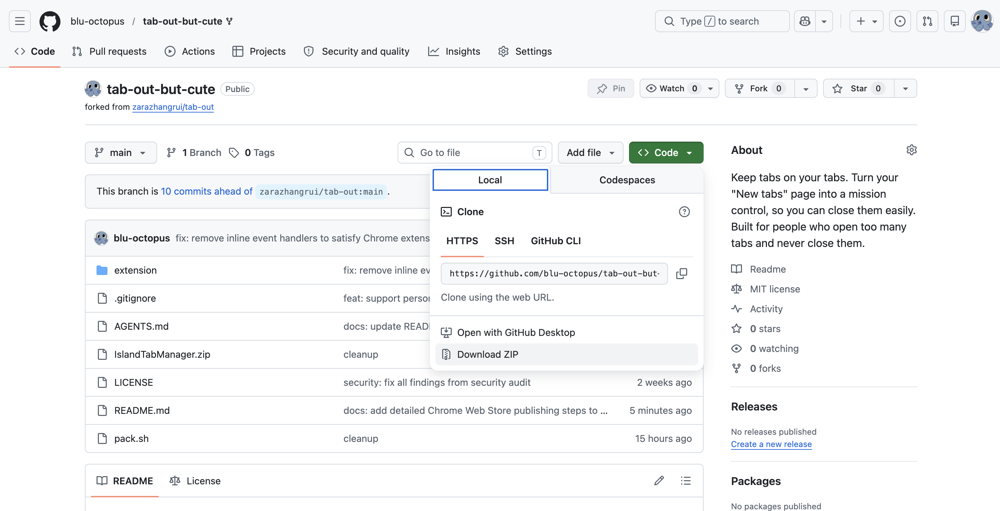
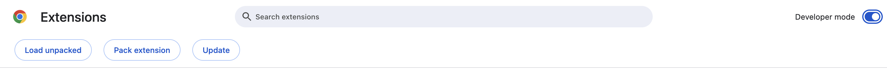

# Island Tab Manager

> Are you someone who is highkey more productive when a friendly shopkeeper keeps pushing you for bells?

Now you can be your own shopkeeper every day!
Manage your tabs better while you're at it, yes yes ✨

**Island Tab Manager** is a cozy island-life themed Chrome new-tab extension that replaces your new-tab page with a dashboard of everything you have open. Tabs are grouped by domain. You get time-aware island villager greetings, live weather, a built-in Eisenhower matrix to-do list, and a tab health score all in a warm, rounded island aesthetic.

> **Chrome / Edge only.** This extension uses Chrome Manifest V3 APIs (`chrome.tabs`, `chrome.storage.sync`, `chrome.tabGroups`). Firefox is not supported.

## How to Download

### Step 1 Download
1. Press the Green "Code" button
2. Select Download Zip

### Step 2 Unzip

1. **Unzip** into a permanent folder (e.g. `~/Desktop/IslandTabManager/`). Don't delete this folder. Chrome needs it loaded.
2. Open **`[chrome://extensions](chrome://extensions/)`** (or `edge://extensions`)
3. Toggle **Developer mode** on (top-right corner)
4. Click **Load unpacked** and select the unzipped folder -> **Open**

5. Open a new tab, and it's there! Bam! 

> **Tip:** Pin the extension icon from the menu so it's always one click away.

---

### Updating

For version update, repeat Step 1 for a new ZIP:
1. Unzip it, **replacing** the existing folder
2. Go to `chrome://extensions, click the **refresh** icon on the Island Tab Manager card

---

## Features

### Tab management
- **See all your tabs at a glance** ?X clean grid, grouped by domain
- **Color-coded categories** ?X work, school, jobs, social, dev, art, and more, each with a distinct accent color
- **Close tabs with style** ?X satisfying swoosh sound + confetti burst
- **Duplicate detection** ?X one-click cleanup for tabs you have open twice
- **Save for later** ?X bookmark a tab to a checklist before closing it
- **Click any tab to jump to it** across windows, no new tab opened
- **Drag tabs between groups** ?X reorganise cards by dragging chips
- **Merge groups by drag-hold** ?X combine two domain cards; they shake and fuse

### Dynamic greetings & weather
- **Time-aware greetings** ?X morning, afternoon, evening, and night, each with rotating island dialogue
- **Live weather** via [Open-Meteo](https://open-meteo.com/) ?X rendered as a cozy island weather report

### o-Do (Eisenhower Matrix)
- **Four quadrants** ?X Do, Schedule, Delegate, Cut ?X so you can prioritise like a productive islander
- **Click any row to check/uncheck** ?X no tiny checkbox hunting
- **Hover to delete** ?X same interaction as closing a tab chip
- **@ mention tabs** ?X type `@` in the task input to link a task to an open tab group
- **Persistent** ?X tasks survive browser restarts via `chrome.storage.sync` + `localStorage` fallback

### Tab Health Heads Up Display
- **Real-time score (0?V100)** based on how organised your tabs are
- **S** Island Points Earned
- Score goes up when you use the matrix, merge groups, and save tabs for later

### Cozy extras
- Dancing island villager GIFs near the footer. Xlick to cycle characters, hover for in-character dialogue
- Click-anywhere SVG particle burst effect
- Custom finger cursor and leaf header decoration
- Ocean wave SVG footer

---

## Data across devices

Island Tab Manager uses **`chrome.storage.sync`**:

- Your to-do tasks, saved tabs, and group merges **follow your Chrome profile** across signed-in devices automatically
- Data survives browser restarts and tab closes
- If Chrome sync is off, a `localStorage` fallback keeps data local ?X nothing is lost, but it won't move between machines

---

## ? Privacy

**Island Tab Manager collects zero data.**

| Permission | Why | What it does NOT do |
|-----------|-----|---------------------|
| `tabs` | Read open tab titles & URLs to build the dashboard | Never sends tab data anywhere |
| `storage` | Save tasks & saved tabs via `chrome.storage.sync` | Data stays in your Chrome profile only |
| `activeTab` | Switch focus to a tab when you click it | Cannot read or modify tab content |
| `geolocation` | Fetch local weather | Coordinates go only to [Open-Meteo](https://open-meteo.com/) ?X free, open-source, no account |
| `tabGroups` | Auto-group tabs in Chrome when merging groups | Only affects your own browser |

**No analytics. No ads. No external servers beyond Open-Meteo. Data is never sold, shared, or stored remotely.**

---

## ? Credits

| What | Who |
|------|-----|
| **Put together by** | [blu-octopus (me!)](https://github.com/blu-octopus) |
| **Tab Out** ?X original tab management concept, logic & architecture | [Zara](https://x.com/zarazhangrui) ?P [github.com/zarazhangrui/tab-out](https://github.com/zarazhangrui/tab-out) |
| **Island UI design system** ?X cozy island aesthetic & component library | [guokaigdg](https://github.com/guokaigdg) ?P [animal-island-ui](https://github.com/guokaigdg/animal-island-ui) |
| **Weather data** | [Open-Meteo](https://open-meteo.com/) ?X free, open-source, no API key |
> If you love the original Tab Out, go star [Zara's repo](https://github.com/zarazhangrui/tab-out). If you love the island UI design, go star [guokaigdg's component library](https://github.com/guokaigdg/animal-island-ui). They deserve the bells, yes yes!

---

## Tech stack

| What | How |
|------|-----|
| Extension runtime | Chrome Manifest V3 |
| Storage | `chrome.storage.sync` + `localStorage` fallback |
| Sound | Web Audio API (synthesised ?X no audio files) |
| Animations | CSS transitions + JS particle shards on click |
| Weather | [Open-Meteo API](https://open-meteo.com/) (free, no key required) |
| Design inspiration | [Island UI by guokaigdg](https://github.com/guokaigdg/animal-island-ui) |
| Font | Nunito (Google Fonts) |

---

## Licence

The **code** is MIT, same as the original Tab Out by Zara.

The **villager GIF assets** are fan-captured clips used for personal, non-commercial purposes only.

Please keep credits intact. 

Hope you have a fun time! The shopkeeper believes in fair trade, hm hm!?
